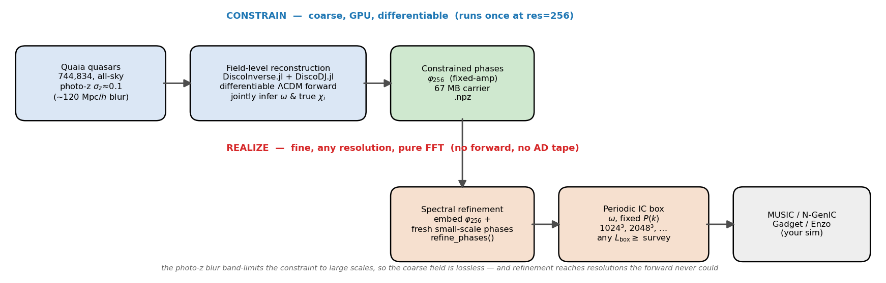
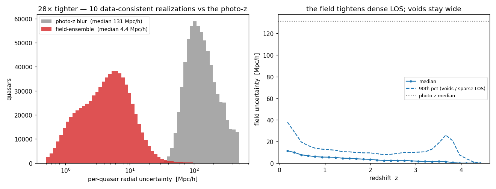
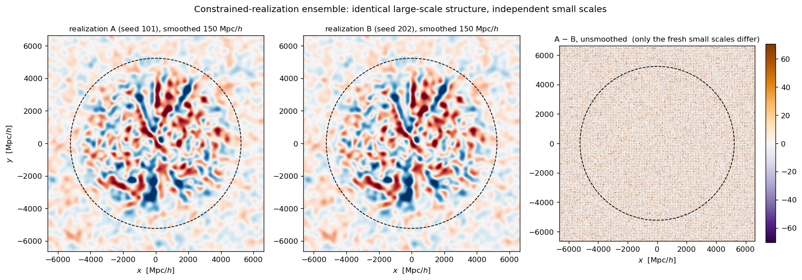
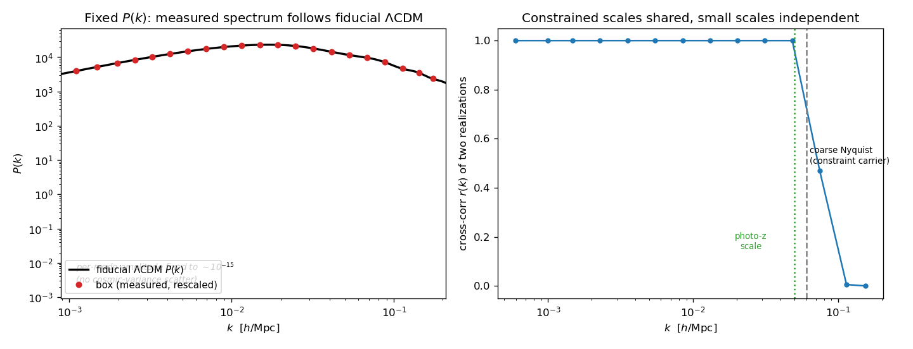
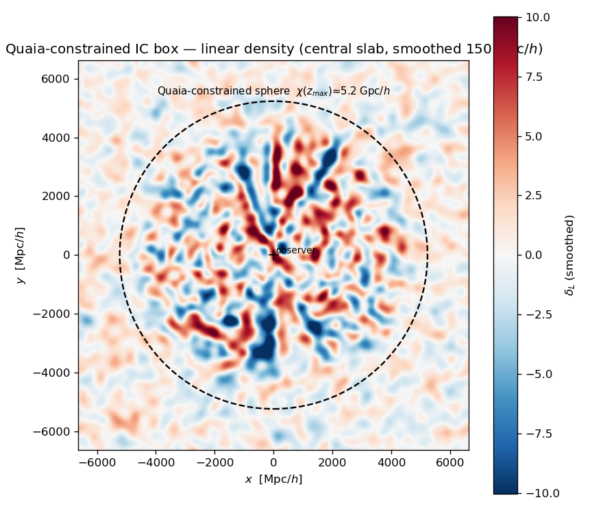

# QuaiaICs

**Constrained cosmological initial conditions from the Quaia quasar catalog.**

Periodic ΛCDM initial-condition boxes whose **centre is constrained** to be consistent with the
large-scale structure traced by the [Quaia](https://zenodo.org/records/8060755) quasars (within their
photometric-redshift errors) and a fiducial cosmology, with the rest of the box an unconstrained random
realization — at **any resolution and any box size ≥ the Quaia volume**, with **exactly fixed P(k)**.

These are drop-in white-noise fields for [MUSIC](https://github.com/cosmo-sims/MUSIC), N‑GenIC/Gadget,
Enzo, or [DiscoDJ.jl](https://github.com/yipihey/DISCO-DJ) — for constrained simulations of the volume
Quaia samples, for testing analysis pipelines against a known large-scale field, or as a phase-fixed
ΛCDM box for any large-scale-structure modelling.



---

## What these are

A primordial **Gaussian white-noise field** `ω` on a periodic cube. Run it through the standard
IC machinery (`ω → √P(k)·ω → Zel'dovich/2LPT displacements`) and you get a ΛCDM simulation IC. What
makes *these* boxes special:

- **The phases in the central sphere are not random** — they are inferred so that the resulting density
  field reproduces the 3‑D clustering of the Quaia quasars, within the ~120 Mpc/h photo‑z uncertainty.
- **The power spectrum is exactly the fiducial ΛCDM P(k)** at every scale (fixed-amplitude / Angulo–
  Pontzen), so a single box already behaves like the ensemble mean — no cosmic-variance scatter in P(k).
- **You choose the resolution and the box size.** The constraint is computed once and then *realized*
  at whatever grid you need (1024³, 2048³, …) — see [the resolution trick](#coarse-constrain--fine-realize).

| | |
|---|---|
| Cosmology | Ω_m = 0.315, Ω_b = 0.049, h = 0.674, σ₈ = 0.81, n_s = 0.965 (Planck18-like) |
| Box (reference) | L = 13 260 Mpc/h, observer at the centre, comoving units |
| Constrained region | central sphere of radius χ(z_max) ≈ 5 230 Mpc/h (the all-sky Quaia volume) |
| Constraint | 744 834 Quaia quasars, z ≈ 0–4.7, linear bias b₁ = 2.5 |
| Informed scales | k ≲ 0.05 h/Mpc (≳ ~120 Mpc/h) — set by the photo-z error |
| Resolution | **your choice** — re-realized from the constraint carrier at any res |

---

## How they are derived

### 1. The Quaia catalog and its photo-z problem

[Quaia](https://arxiv.org/abs/2306.17749) (Storey‑Fisher et al. 2024) is an all-sky Gaia×unWISE quasar
catalog. Its angular positions are essentially exact, but the redshifts are *spectro-photometric* with
errors σ_z ≈ 0.03–0.12 — a radial smearing of **~120 Mpc/h**, far larger than the clustering scale. The
3‑D map is sharp on the sky and badly blurred along the line of sight.

### 2. Field-level reconstruction (DiscoInverse.jl + DiscoDJ.jl)

We resolve that blur with a **differentiable field-level forward model**. The white-noise field `ω` is
mapped to a model quasar density through the full ΛCDM chain — IC operator → nLPT displacements →
past-lightcone → tetrahedral CDM-sheet density — implemented end-to-end differentiably in
**[DiscoDJ.jl](https://github.com/yipihey/DISCO-DJ)** (a native-Julia port of DISCO‑DJ) and driven by
**[DiscoInverse.jl](https://github.com/yipihey/DiscoInverse.jl)**. We then jointly infer

- the white-noise field `ω`, **and**
- each quasar's true comoving distance `χ_i`,

constrained by (a) the photo-z Gaussian likelihood and (b) the 3‑D clustering (the quasars trace the
density). Parametrizing by comoving distance keeps the embedding linear and the whole pipeline gradient-
clean; quasar positions become free, differentiable parameters via a query-point density gradient.

The reconstruction tightens each quasar's radial position from the ~120 Mpc/h photo-z blur down to a few
Mpc/h where the field is informative, leaving voids and gaps photo-z-wide — the honest, field-constrained
uncertainty the photo-z catalog cannot give:



### 3. Constrained realizations & fixed P(k)

The field is parametrized by its **Fourier phases only**, with every mode amplitude pinned to √P(k)
(the **Angulo–Pontzen fixed-amplitude** construction). The reconstruction moves the phases the data
constrain; the rest stay at their random draw. The result is a **constrained realization**: a valid
random ΛCDM field that *also* matches Quaia where Quaia is informative. Drawing different random seeds
for the unconstrained phases gives an **ensemble** that shares the constrained structure and differs
elsewhere — that spread is the residual uncertainty.



The amplitudes are fixed to machine precision (per-mode |ω̂(k)|² constant to ~10⁻¹⁵), so the box has
the fiducial ΛCDM P(k) at every scale with no cosmic-variance scatter, and two realizations share every
mode below the constrained scale and decorrelate above it:



### Coarse-constrain → fine-realize

This is the key that makes **any resolution** possible. The differentiable forward is memory-heavy and
caps at ≈384³ on a single GPU. But the photo-z blur band-limits the constraint to **large scales**
(k ≲ 0.05 h/Mpc) — there is no small-scale information in the data. So we:

1. **Constrain** the phases on a coarse grid (res = 256) where the differentiable forward runs — losing
   nothing, because the data only inform those scales. This produces a compact **constraint carrier**
   (`quaia_icbox_phases.npz`, ~67 MB).
2. **Realize** the box at any resolution by **spectral white-noise refinement**: embed the constrained
   coarse phases into the fine grid at their physical wavenumbers and fill the new small-scale modes with
   fresh random phases. This is a pure FFT — no forward model, no autodiff tape — so it scales to 1024³,
   2048³, and beyond, limited only by ordinary array memory.

A 1024³ box realizes in ~50 s and reproduces the coarse constraint to a cross-correlation of 1.0000; a
2048³ box (140× more cells than the forward could ever hold) realizes in ~7 min. See
[docs/method.md](docs/method.md) for the full derivation.



---

## What's in this repository

```
QuaiaICs/
├── README.md                     ← you are here
├── manifest.json                 ← cosmology, box, constraint metadata (machine-readable)
├── docs/
│   ├── method.md                 ← detailed derivation & math
│   └── usage.md                  ← MUSIC / N-GenIC / DiscoDJ, resolution, box size, zoom-ins
├── examples/
│   ├── realize_box.jl            ← carrier → ω at ANY resolution → raw float32
│   ├── make_music_wnoise.jl      ← ω → MUSIC white-noise file (exact format)
│   ├── snapshot_discodj.jl       ← carrier → particle IC snapshot directly (no external code)
│   ├── music_unigrid.conf        ← MUSIC config: uni-grid, reads our white noise
│   └── music_zoom.conf           ← MUSIC config: zoom-in around a chosen region
├── figures/
└── data/README.md                ← how to download the constraint carrier (the data product)
```

The **data product** is the ~67 MB constraint carrier (`quaia_icbox_phases.npz`). It fully determines the
box; every resolution is re-realized from it locally (so we do not ship multi-GB grids). See
[data/README.md](data/README.md).

---

## Quick start

```bash
# 1. get the constraint carrier (see data/README.md)
#    → quaia_icbox_phases.npz

# 2. realize the white-noise box at the resolution you want (pure Julia, CPU, no GPU needed)
julia examples/realize_box.jl quaia_icbox_phases.npz 1024 omega_1024.f32

# 3a. either hand the white noise to MUSIC …
julia examples/make_music_wnoise.jl quaia_icbox_phases.npz 1024 wnoise_music.bin
#     then point MUSIC at it (examples/music_unigrid.conf) and run your sim

# 3b. … or make a particle snapshot directly with DiscoDJ.jl
julia examples/snapshot_discodj.jl quaia_icbox_phases.npz 512 49.0   # res, z_init
```

---

## Choosing resolution and box size

- **Resolution** is entirely up to you. The constraint lives at k ≲ 0.05 h/Mpc; any grid whose Nyquist
  exceeds that resolves it. Pick the resolution your simulation needs — the small scales are filled with a
  fresh, statistically-correct ΛCDM random field that inherits the constrained large-scale tidal field.
- **Box size** is fixed at L = 13 260 Mpc/h for *this* carrier (it must contain the all-sky Quaia volume).
  You may realize into a **larger** periodic box (more unconstrained padding around the Quaia sphere) by
  re-running the reconstruction with a bigger `boxsize`; see [docs/usage.md](docs/usage.md). A *smaller*
  box would cut the survey and is not supported by this carrier.
- Different **random seeds** give independent ensemble members (same constraint, different unconstrained
  phases) — pass `--seed` to `realize_box.jl`.

Full details, including the convention and unit definitions, in [docs/usage.md](docs/usage.md).

---

## Using the ICs

See **[docs/usage.md](docs/usage.md)** for complete, copy-pasteable instructions for:

- **MUSIC** — `ω` is written to MUSIC's white-noise file format and read per level via
  `seed[level] = <file>`; MUSIC then outputs Gadget/Enzo/grafic ICs and handles uni-grid **and zoom-in**
  refinement on top of the constrained field.
- **N-GenIC / Gadget / 2LPTic** — these generate their own phases, so route through MUSIC (which outputs
  their formats) or use DiscoDJ.jl directly; the white-noise convention to match is documented.
- **DiscoDJ.jl** — generate the displacement / particle snapshot directly in Julia at any redshift, no
  external IC code required.
- **Zoom-in simulations** — place a high-resolution Lagrangian patch inside the constrained box; the
  Quaia-constrained modes supply the correct large-scale tidal field around your zoom region.

---

## Cosmology & conventions

- **Units:** comoving Mpc/h. **Cosmology:** Planck18-like (above). **Gauge:** −1/k² (infall into
  overdensities). **White noise:** unit-variance, mean zero, periodic. **Observer:** at the box centre
  (the Quaia volume is the inscribed sphere). Full machine-readable list in [manifest.json](manifest.json).
- The **sign / ordering convention** when handing the field to an external code must be matched on first
  use (flagged in the MUSIC example) — sanity-check that overdensities land where the Quaia quasars are.

## Caveats & honest scope

- The constrained modes are a **maximum-a-posteriori** estimate, not posterior samples; the unconstrained
  phases are a genuine random draw and the ensemble spans that freedom. For rigorous per-mode uncertainty,
  use multiple seeds.
- Only **large scales** (k ≲ 0.05 h/Mpc) inside the Quaia sphere are constrained. Small scales everywhere,
  and everything outside the sphere, are an unconstrained ΛCDM realization — by construction.

## Credits, citation & links

These ICs are produced with:

- **[DiscoInverse.jl](https://github.com/yipihey/DiscoInverse.jl)** — field-level inference / the Quaia
  reconstruction and the constrained-IC-box generator.
- **[DiscoDJ.jl](https://github.com/yipihey/DISCO-DJ)** — the differentiable ΛCDM forward (LPT, lightcone,
  IC operator) that powers the reconstruction and the IC realization.
- **[MUSIC](https://github.com/cosmo-sims/MUSIC)** (Hahn & Abel 2011) — multi-scale IC generation; the
  coarse-constrain → fine-realize design follows its multi-scale white-noise paradigm.
- **[Quaia](https://arxiv.org/abs/2306.17749)** (Storey-Fisher, Hogg, et al. 2024) — the quasar catalog.

If you use these initial conditions, please cite the DiscoInverse/DiscoDJ papers (see those repos), the
MUSIC paper, and the Quaia catalog. A `CITATION` entry will be added with the method paper.

## Reproducing

The reconstruction (GPU) and the realization (CPU) are both in
[DiscoInverse.jl](https://github.com/yipihey/DiscoInverse.jl) (`constrained_ic_box`, `refine_phases`,
`export_white_noise`). The carrier in this repo is the saved output of one such run; the examples here
re-realize boxes from it. See [docs/method.md](docs/method.md) for the exact procedure and parameters.
